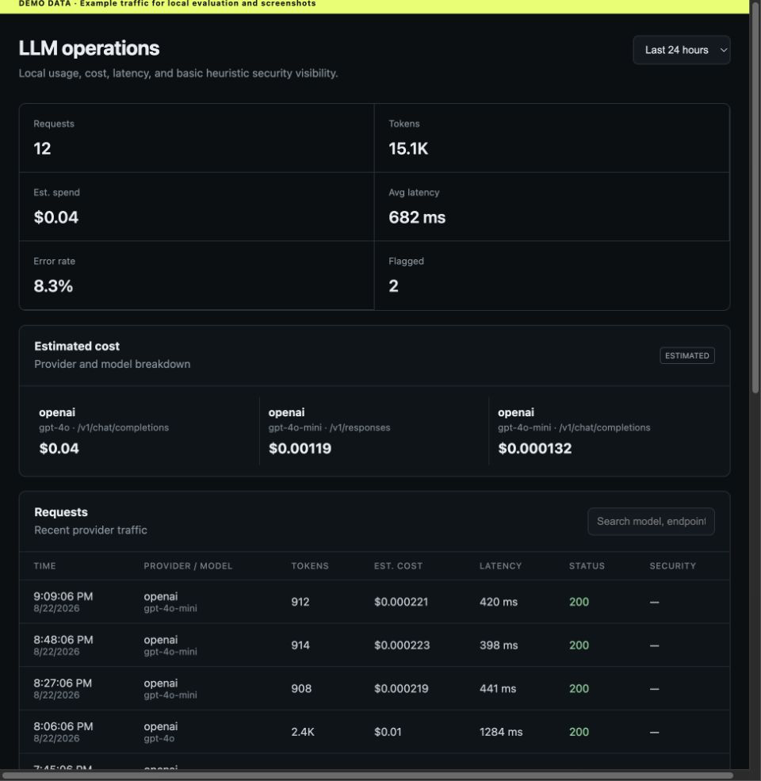

# ModelGate OSS

****Find repetitive and expensive LLM traffic that may not need to stay an LLM call..**

ModelGate OSS is the open-source gateway from ModelGate. For managed analytics, advanced runtime protection, and automated optimization, visit [ModelGate](https://modelgatehq.com/).

> **Early release — v0.1.0.** APIs and storage may change. Not yet recommended for critical production workloads without your own validation.

## Point your SDK at ModelGate and immediately see:

- what every LLM request costs.
- which requests repeat.
- where unnecessary LLM usage may be hiding.
- suspicious prompt-injection patterns.

Local-first. No account required. Prompt content is not stored by default.



Point an OpenAI or Anthropic SDK at ModelGate, keep normal provider responses—including streams—and inspect metadata locally at `http://localhost:3000`. No account required. Prompt and response content is **not stored by default**, and ModelGate OSS sends **no external telemetry**.

## Features

- OpenAI Chat Completions and Responses proxying
- Anthropic Messages proxying under `/anthropic/v1/messages`
- Incremental streaming without waiting for the complete response
- Token, estimated cost, latency, model, status, and application metadata
- Exact normalized repeated-prompt groups computed locally
- Transparent basic heuristic rules for obvious suspicious instructions
- Embedded SQLite storage and a searchable local dashboard
- No ModelGate account, Cloud connection, or external analytics

## From zero to your first traced LLM request in ~2 minutes
## Two-minute Docker quick start

```bash
git clone https://github.com/razdgann/modelgate-oss.git
cd modelgate-oss
cp .env.example .env
# Add OPENAI_API_KEY and/or ANTHROPIC_API_KEY to .env
docker compose up --build
```

- Gateway and API: [http://localhost:8080](http://localhost:8080)
- Dashboard: [http://localhost:3000](http://localhost:3000)
- Health check: [http://localhost:8080/health](http://localhost:8080/health)

SQLite initializes automatically and persists in the `modelgate-data` Docker volume. No external database or production infrastructure is required.

For local development without Docker, install Node.js 22.5+ (24 recommended), run `npm start`, and use the same URLs.

## OpenAI

```python
from openai import OpenAI

client = OpenAI(
    api_key="your-local-sdk-value",
    base_url="http://localhost:8080/v1",
)
response = client.responses.create(model="gpt-4o-mini", input="Hello")
```

ModelGate discards the incoming `Authorization` value and authenticates upstream with `OPENAI_API_KEY` from its own environment. Never commit that key.

## Anthropic

Set the Anthropic SDK base URL to `http://localhost:8080/anthropic`. Requests to `/anthropic/v1/messages` are forwarded using `ANTHROPIC_API_KEY` from ModelGate's environment. Incoming `x-api-key` values are discarded.

## Dashboard and API

The dashboard shows 24-hour, 7-day, and 30-day overview metrics, estimated cost breakdowns, recent requests, repeated request groups, and heuristic security findings. Request details explicitly say “Prompt content was not stored” when capture is disabled.

Local endpoints include `/api/stats`, `/api/requests`, `/api/requests/:id`, `/api/costs`, `/api/models`, `/api/repetitions`, `/api/security`, and `/health`. Request lists are paginated and errors use `{ "error": { "code", "message" } }`.

## Privacy and content capture

`MODELGATE_CAPTURE_CONTENT=false` is the default. When disabled, ModelGate persists operational metadata and a one-way normalized prompt fingerprint, but not raw prompts, model responses, authorization headers, API keys, cookies, or arbitrary request headers.

Enable content capture only for local debugging after reviewing your privacy and retention obligations. `X-ModelGate-User` values should be pseudonymous—not names or email addresses.

Optional metadata headers are `X-ModelGate-App`, `X-ModelGate-User`, `X-ModelGate-Feature`, and comma-separated `X-ModelGate-Tags`.

ModelGate OSS contains no outbound ModelGate Cloud client and sends no product telemetry. Provider requests still go to the configured LLM provider, subject to that provider's data practices.

## Estimated costs

Costs are estimates from the dated central registry in `src/pricing/registry.js`. Every entry includes an effective date, review date, and official provider pricing source. Provider billing may differ because of cached tokens, batch pricing, tiers, regional pricing, or later price changes. Unknown models continue normally and display no estimate.

## Architecture

A single dependency-free Node.js service performs provider-aware forwarding and serves the analytics API. A separately bound embedded dashboard reads that local API. Provider, pricing, security, repetition, and SQLite storage modules remain isolated so contributors can extend them independently. Persistence happens after provider handling; analytics failures do not replace successful provider responses.

## Configuration

| Variable | Default | Purpose |
|---|---:|---|
| `MODELGATE_HOST` | `127.0.0.1` | Bind address; Compose sets `0.0.0.0` inside the container |
| `MODELGATE_PORT` | `8080` | Gateway/API port |
| `MODELGATE_DASHBOARD_PORT` | `3000` | Dashboard port |
| `MODELGATE_DATABASE_URL` | `./data/modelgate.db` | SQLite path |
| `MODELGATE_CAPTURE_CONTENT` | `false` | Store prompt/response bodies |
| `MODELGATE_LOG_LEVEL` | `info` | Reserved log verbosity setting |
| `MODELGATE_PROVIDER_TIMEOUT_MS` | `120000` | Provider timeout |
| `MODELGATE_MAX_REQUEST_BYTES` | `10485760` | Maximum request body size |
| `OPENAI_API_KEY` | — | OpenAI upstream credential |
| `ANTHROPIC_API_KEY` | — | Anthropic upstream credential |

## Security and self-hosting

The gateway constructs requests only from configured provider origins; it is not an arbitrary URL proxy. Incoming credentials, proxy credentials, cookies, hop-by-hop headers, and ModelGate metadata headers are not forwarded indiscriminately or stored. Request bodies are limited to 10 MiB by default and provider calls time out.

The dashboard and API have no built-in authentication in v0.1. Keep the default loopback binding for local use. If exposing ModelGate beyond a trusted machine, put authenticated TLS termination in front of both ports, restrict network access, encrypt disks/backups, configure retention, and protect `.env`. See [SECURITY.md](SECURITY.md).

Security findings are simple, public regex heuristics. “Informational,” “suspicious,” and “high risk” describe a matched pattern's apparent intent—not certainty, exploitability, or complete prompt-injection protection.

## Deterministic demo

Run `npm run demo` to create clearly labeled example metadata without provider keys or network calls. It demonstrates costs, repeated groups, a rate-limit error, and basic security findings. The dashboard banner makes clear that this is demo data. Capture instructions live in [docs/assets/README.md](docs/assets/README.md).

## Development and contributing

```bash
npm test
npm run lint
npm run typecheck
npm run build
npm audit
```

Tests use mocked providers and never require paid API access. See [CONTRIBUTING.md](CONTRIBUTING.md) before proposing a change.

## Roadmap

- More provider adapters and streaming event fixtures
- Configurable retention and metadata export
- Approximate local repetition grouping
- Pluggable storage backends for deployments beyond one SQLite instance
- Broader SDK compatibility testing

## ModelGate Cloud and the OSS boundary

ModelGate OSS remains useful without an account. ModelGate Cloud is intended for managed infrastructure, continuous optimization, advanced runtime protection, shared team analytics, longer retention, and commercial optimization recommendations. Proprietary detection, optimization, ranking, enterprise policy, and SaaS business logic are intentionally not included here.

## License

Apache License 2.0. See [LICENSE](LICENSE). The neutral copyright reference and license choice should receive owner/legal review before public release.
